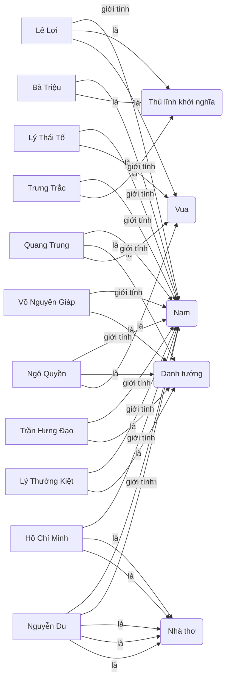
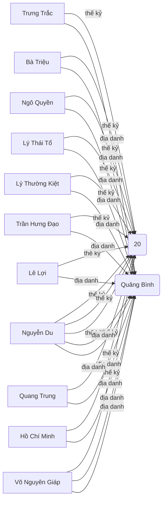
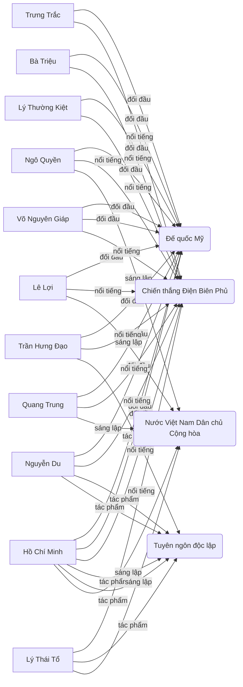
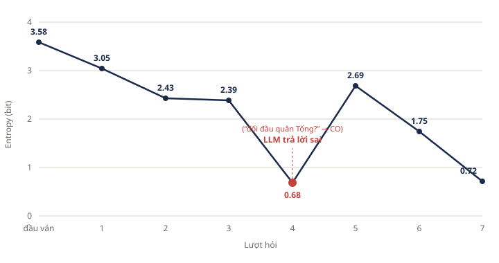
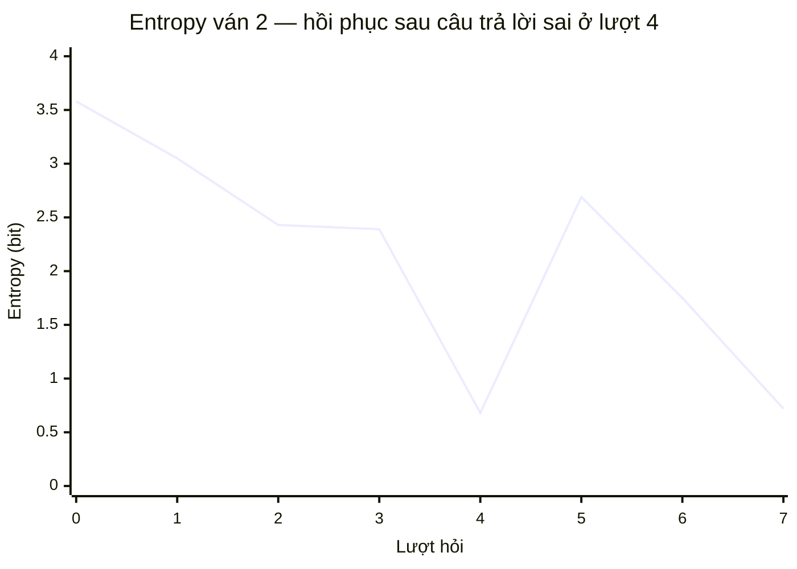

# Số liệu cho báo cáo — Bài 3

Trò chơi đoán nhân vật lịch sử Việt Nam trên nền mạng ngữ nghĩa, chiến lược hỏi
dựa trên information gain, LLM đóng vai người giữ bí mật.

---

## 1. Mạng ngữ nghĩa

Cơ sở tri thức gồm **12 thực thể** và **89 bộ ba** `(subject, predicate, object)`
trên 8 vị từ. Từ 89 bộ ba, hệ thống sinh tự động **58 câu hỏi nhị phân**: mỗi cặp
`(vị từ, đối tượng)` cho một câu hỏi, cộng thêm các câu hỏi dẫn xuất theo khoảng
thế kỷ; chỉ loại những đặc trưng rỗng hoặc đúng cho toàn bộ cơ sở tri thức, và bỏ
`gioi-tinh:Nam` vì trùng thông tin với `gioi-tinh:Nữ`.

Vẽ cả 89 quan hệ trên một hình sẽ không đọc được, nên mạng được tách thành ba sơ đồ
theo nhóm vị từ.

### 1.1. Phân loại và giới tính — `is-a`, `gioi-tinh`

Nhóm này chia không gian tìm kiếm thành những khối lớn ngay từ vài lượt đầu: mỗi
câu hỏi dạng "là danh tướng?", "là nhà thơ?" cắt tập ứng viên gần đôi, nên thường
được bộ chọn câu hỏi ưu tiên ở lượt 2–4 khi entropy còn cao.



### 1.2. Thời gian và không gian — `thuoc-the-ky`, `gan-voi-dia-danh`

Nhóm này đảm nhiệm việc định vị nhân vật trên trục thời gian và địa lý. Câu hỏi dẫn
xuất "sống trước thế kỷ 15?" chia đúng 6/12 nhân vật nên luôn được chọn ở lượt 1 với
information gain 1.00 bit — mức cắt tối đa của một câu hỏi nhị phân.



### 1.3. Sự kiện và di sản — `doi-dau-voi`, `noi-tieng-voi`, `co-tac-pham`, `sang-lap`

Nhóm này phần lớn là đặc trưng đơn thể (chỉ đúng với một nhân vật) nên information
gain thấp khi tập ứng viên còn lớn, nhưng trở thành công cụ tách quyết định ở những
lượt cuối, khi chỉ còn hai hoặc ba ứng viên cần phân biệt.



---

## 2. Kết quả thực nghiệm — bốn mức số liệu

| Cấu hình | Tỷ lệ đúng | Lượt TB | Ý nghĩa |
|---|---|---|---|
| Oracle lấy thẳng từ KB, sau tinh chỉnh | 100% (12/12) | 4.42 | Cận trên lý thuyết của bộ suy diễn, **không phải số liệu thực nghiệm** |
| LLM giữ bí mật, sau tinh chỉnh | 100% (5/5) | 5.60 | Kết quả thực nghiệm chính |
| LLM giữ bí mật, trước tinh chỉnh | 60% (3/5) | 6.80 | Đối chứng cho Bước 3 — đánh giá tinh chỉnh mạng ngữ nghĩa |
| Baseline: LLM đoán mò, không có mạng ngữ nghĩa | — | 9.40 | Đối chứng cho Bước 4 — đánh giá giá trị của mạng ngữ nghĩa |

Giải thích từng dòng:

- **Dòng 1** không phải kết quả chạy thật với LLM. Đây là phép quét toàn bộ 12 nhân
  vật trong đó người giữ bí mật là chính cơ sở tri thức: mọi câu trả lời đều đúng
  tuyệt đối. Con số 4.42 vì vậy là **cận trên lý thuyết** — mức tốt nhất bộ suy diễn
  có thể đạt khi không có nhiễu. Nó chỉ dùng để xác nhận thuật toán chọn câu hỏi và
  cập nhật xác suất hoạt động đúng, không dùng để đánh giá hệ thống hoàn chỉnh.
  Cận dưới tuyệt đối của bài toán là ⌈log₂12⌉ = ⌈3.58⌉ = 4 lượt, nên 4.42 đã rất sát.
- **Dòng 2** là số liệu thực nghiệm thật: LLM giữ bí mật và tự trả lời bằng kiến thức
  sẵn có của nó. Đoán đúng cả 5 ván.
- **Chênh lệch 5.60 − 4.42 = 1.18 lượt giữa dòng 1 và dòng 2 chính là chi phí do LLM
  trả lời sai.** Phần 5 phân tích cụ thể hai trường hợp trả lời sai gây ra khoản chi
  phí này.
- **Dòng 3** là cùng hệ thống trước khi sửa bốn lỗi ở phần 4, dùng làm mốc so sánh.
- **Dòng 4** là nhánh đối chứng: LLM tự sinh câu hỏi, không được cấp mạng ngữ nghĩa.

### Chi tiết 5 ván sau tinh chỉnh

| Ván | Nhân vật bí mật | Số lượt | Đoán cuối | Kết quả |
|---|---|---|---|---|
| 1 | Trần Hưng Đạo | 5 | Trần Hưng Đạo | Đúng |
| 2 | Trưng Trắc | 7 | Trưng Trắc | Đúng |
| 3 | Quang Trung | 5 | Quang Trung | Đúng |
| 4 | Võ Nguyên Giáp | 4 | Võ Nguyên Giáp | Đúng |
| 5 | Nguyễn Du | 7 | Nguyễn Du | Đúng |

Hai ván dài nhất (7 lượt, trên mức trung bình) đều là ván có câu trả lời sai từ LLM;
ba ván còn lại đạt 4–5 lượt, tức gần cận trên lý thuyết.

---

## 3. So sánh có / không dùng mạng ngữ nghĩa (Bước 4)

| Phương pháp | Số lượt trung bình | Tỷ lệ đoán đúng |
|---|---|---|
| Có mạng ngữ nghĩa, chọn câu hỏi theo information gain | 5.60 | 100% (5/5) |
| Đối chứng: LLM đoán mò, không có mạng ngữ nghĩa | 9.40 | — |

Nhánh có mạng ngữ nghĩa rút ngắn **3.8 lượt**, tương đương giảm 40% số lượt so với
nhánh đoán mò, và nhánh đoán mò gần chạm trần 10 lượt của luật chơi. Nguyên nhân là
LLM khi tự sinh câu hỏi không có mô hình xác suất về không gian ứng viên, nên đặt
nhiều câu hỏi đặc thù có information gain thấp thay vì câu hỏi chia đôi không gian.
Lưu ý giới hạn của phép so sánh này ở phần 6.

---

## 4. Phân tích lỗi và tinh chỉnh mạng ngữ nghĩa (Bước 3)

Lần chạy đầu tiên (`logs/ket-qua-5-van-truoc-tinh-chinh.json`) chỉ đạt 60% đúng với
6.8 lượt trung bình. Đọc log phát hiện bốn lỗi, ba trong số đó thuộc về thiết kế
mạng ngữ nghĩa chứ không phải thuật toán.

### 4.1. Thiếu nhánh dừng khi cạn lượt

Ván 4 (bí mật: Lê Lợi) kết thúc ở lượt 10 với **entropy chỉ còn 0.62 bit** nhưng
trường `doanCuoi` rỗng — hệ thống đã gần như xác định được đáp án mà không đưa ra
lời đoán nào. Nguyên nhân nằm ở vòng lặp tự chơi: điều kiện lặp thoát khi số lượt
chạm 10 *trước khi* kiểm tra điều kiện đoán, nên nhánh "cạn lượt" của quy tắc dừng
không bao giờ được thực thi. Đã sửa bằng cách luôn đoán ứng viên có xác suất hậu
nghiệm cao nhất trước khi thoát vòng lặp.

### 4.2. Bộ lọc đặc trưng loại mất khả năng phân biệt

Đây là lỗi nghiêm trọng nhất về mặt tri thức. Bộ lọc ban đầu chỉ giữ những đặc trưng
có số nhân vật thỏa mãn nằm trong khoảng `[2, 10]`, với lập luận rằng đặc trưng quá
lệch thì information gain thấp. Hệ quả là **toàn bộ đặc trưng đơn thể bị loại**:
"đối đầu quân Đông Hán" (chỉ Trưng Trắc), "thế kỷ 1", "thế kỷ 3" đều biến mất khỏi
tập câu hỏi.

Ván 5 (bí mật: Trưng Trắc) cho thấy hậu quả: sau lượt 6, tập ứng viên thu về đúng hai
người là Trưng Trắc và Bà Triệu, nhưng không còn câu hỏi nào tách được hai người đó.
Ba lượt cuối có information gain lần lượt **0.15, 0.03 và 0.01 bit** — gần như vô ích
— và ván chơi thất bại.

Đã nới ngưỡng thành `[1, 11]`, tức chỉ loại đặc trưng rỗng hoặc đúng cho toàn bộ cơ
sở tri thức. Tập câu hỏi tăng từ 23 lên 58. Không cần cơ chế ưu tiên riêng cho đặc
trưng đơn thể: bản thân công thức information gain đã tự xếp chúng xuống thấp khi tập
ứng viên còn lớn và đẩy lên cao khi chỉ còn vài ứng viên.

### 4.3. Không dừng sớm khi hết câu hỏi hữu ích

Cũng ở ván 5, hệ thống tiếp tục hỏi ngay cả khi câu hỏi tốt nhất chỉ còn 0.01 bit.
Quy tắc dừng ban đầu chỉ có hai nhánh: đủ tự tin (xác suất hậu nghiệm cao nhất ≥ 0.85)
hoặc cạn lượt. Đã bổ sung nhánh thứ ba: nếu information gain lớn nhất trên mọi câu hỏi
chưa hỏi nhỏ hơn 0.2 bit thì ngừng hỏi và đoán ngay.

### 4.4. Đặc trưng trùng lặp về mặt thông tin

`gioi-tinh:Nam` và `gioi-tinh:Nữ` mang đúng cùng một bit thông tin: biết câu trả lời
cho một trong hai là biết luôn câu kia. Ván 5 hỏi "là nữ?" ở lượt 7 rồi "là nam?" ở
lượt 8, và lượt thứ hai chỉ thu được 0.15 bit. Đã sửa bằng cách chỉ sinh đặc trưng
cho `gioi-tinh:Nữ`.

### 4.5. Kết quả tinh chỉnh

| Chỉ số | Trước tinh chỉnh | Sau tinh chỉnh |
|---|---|---|
| Tỷ lệ đoán đúng | 60% (3/5) | 100% (5/5) |
| Số lượt trung bình | 6.80 | 5.60 |
| Số câu hỏi khả dụng | 23 | 58 |

### 4.6. Nhánh còn thiếu, chưa sửa

Cơ sở tri thức hiện chưa có vị từ mô tả vai trò dân sự (nhà ngoại giao, nhà giáo, nhà
cải cách). Thiếu nhánh này khiến những nhân vật vừa làm thơ vừa tham chính khó tách
khỏi nhau bằng nhãn `is-a`; trường hợp cụ thể được nêu ở mục 5.3.

---

## 5. Khả năng chịu lỗi của cơ chế Bayes mềm

Đây là phát hiện đáng chú ý nhất của thực nghiệm. Bộ suy diễn không lọc cứng ứng viên
sau mỗi câu trả lời, mà nhân xác suất hậu nghiệm với hệ số 0.9 nếu ứng viên khớp câu
trả lời và 0.1 nếu không khớp, tương ứng giả định LLM trả lời sai với xác suất
ε = 0.1. Ván 2 cho thấy vì sao lựa chọn này là thiết yếu.

### 5.1. Ván 2 — câu trả lời sai lệch gần một nghìn năm

Nhân vật bí mật là Trưng Trắc. Ở **lượt 4**, hệ thống hỏi *"Nhân vật này từng đối đầu
với quân Tống?"* và LLM trả lời **CO**. Đây là một khẳng định sai sự thật: Hai Bà Trưng
khởi nghĩa chống **quân Đông Hán** năm 40, còn chiến tranh Tống – Việt diễn ra vào thế
kỷ 11 dưới thời Lý Thường Kiệt. Câu trả lời lệch gần một nghìn năm.

Diễn biến entropy của ván này:

| Lượt | Câu hỏi | Trả lời | Entropy sau lượt |
|---|---|---|---|
| — | *(khởi tạo đều)* | — | 3.58 |
| 1 | Nhân vật này sống trước thế kỷ 15? | CO | 3.05 |
| 2 | Nhân vật này là danh tướng? | CO | 2.43 |
| 3 | Nhân vật này nổi tiếng với chiến thắng Bạch Đằng? | KHONG | 2.39 |
| 4 | **Nhân vật này từng đối đầu với quân Tống?** | **CO** *(sai)* | **0.68** |
| 5 | Nhân vật này là vua? | KHONG | 2.69 |
| 6 | Nhân vật này là thủ lĩnh khởi nghĩa? | CO | 1.75 |
| 7 | Nhân vật này sống ở thế kỷ 1? | CO | 0.72 |





> Hai hình trên cùng một dữ liệu. Dùng file `hinh-entropy-van2.svg` khi dán vào báo
> cáo Word; khối `xychart-beta` dành cho trình xem hỗ trợ Mermaid.

Đọc đồ thị: entropy giảm đều qua ba lượt đầu, rồi **tụt mạnh xuống 0.68 bit ở lượt 4**
— hệ thống gần như đã kết luận nhân vật bí mật là Lý Thường Kiệt, người duy nhất trong
cơ sở tri thức từng đối đầu quân Tống. Đến lượt 5, câu trả lời KHONG cho "là vua?" mâu
thuẫn với giả thuyết đang chiếm ưu thế, và entropy **bật ngược lên 2.69 bit**: hệ thống
tự nhận ra mình đang đi sai hướng và mở lại không gian tìm kiếm. Hai lượt sau đó thu
hẹp lại đúng hướng và ván chơi kết thúc chính xác ở lượt 7.

### 5.2. Vì sao lọc cứng sẽ thất bại

Nếu bộ suy diễn dùng lọc cứng — nghĩa là loại thẳng mọi ứng viên không khớp câu trả lời
thay vì nhân hệ số 0.9/0.1 — thì ở lượt 4, Trưng Trắc sẽ bị gán xác suất 0 và **bị loại
vĩnh viễn**. Không câu hỏi nào ở các lượt sau có thể khôi phục một ứng viên đã bị loại,
nên ván 2 chắc chắn thất bại. Cơ chế Bayes mềm giữ Trưng Trắc ở một xác suất nhỏ nhưng
khác 0, để bằng chứng mâu thuẫn ở các lượt sau kéo ứng viên này trở lại.

Cái giá phải trả là số lượt: ván 2 dùng 7 lượt thay vì 4–5 lượt như các ván không có
câu trả lời sai. Đây chính là phần lớn khoản chênh 1.18 lượt giữa cận trên lý thuyết
(4.42) và kết quả thực nghiệm (5.60) đã nêu ở phần 2.

### 5.3. Trường hợp thứ hai — nhập nhằng nhãn `is-a`

Ván 5 (bí mật: Nguyễn Du) gặp một lỗi nhẹ hơn nhưng cùng bản chất. Ở **lượt 3**, hệ
thống hỏi *"Nhân vật này là nhà chính trị?"* và LLM trả lời **CO**. Trong cơ sở tri
thức, Nguyễn Du chỉ mang nhãn `is-a: Nhà thơ`; nhãn `Nhà chính trị` thuộc về Nguyễn
Trãi và Hồ Chí Minh. Câu trả lời này không sai hoàn toàn về mặt lịch sử — Nguyễn Du
có làm quan dưới triều Nguyễn — nhưng không khớp với cách cơ sở tri thức gán nhãn.

Hậu quả: entropy giảm xuống 1.42 bit theo hướng sai, và hệ thống phải dùng thêm hai
lượt (lượt 6 và 7 hỏi về thế kỷ 18 và 19) để sửa lại, kết thúc ở lượt 7 thay vì 5.

Trường hợp này cho thấy một giới hạn của mạng ngữ nghĩa thủ công: nhãn `is-a` được gán
theo tiêu chí "nhân vật này được biết đến chủ yếu với vai trò gì", trong khi LLM trả
lời theo tiêu chí "nhân vật này có từng giữ vai trò đó không". Hai tiêu chí không trùng
nhau, và đây chính là nhánh còn thiếu đã nêu ở mục 4.6.

---

## 6. Hạn chế

1. **Không gian đáp án đóng.** Nhân vật bí mật luôn được rút từ đúng 12 thực thể có sẵn
   trong cơ sở tri thức. Bài toán vì vậy dễ hơn Akinator thật, nơi đáp án người chơi
   nghĩ tới có thể nằm ngoài cơ sở tri thức và hệ thống phải xử lý được tình huống
   "không có ứng viên nào phù hợp".
2. **Hai nhánh không hoàn toàn cùng điều kiện.** Ở nhánh chính, người giữ bí mật là LLM
   trả lời bằng kiến thức sẵn có của nó — chính vì thế mới xuất hiện các câu trả lời sai
   phân tích ở phần 5. Ở nhánh baseline, người trả lời lại được nạp trực tiếp các bộ ba
   của nhân vật từ cơ sở tri thức nên trả lời chính xác hơn. Con số 5.60 so với 9.40 do
   đó chỉ mang tính tham khảo, không phải một phép so sánh có kiểm soát chặt chẽ.
3. **Cỡ mẫu quá nhỏ.** Năm ván cho mỗi cấu hình là quá ít để kết luận thống kê; các con
   số 5.60 và 9.40 có sai số lớn. Để có kết luận đáng tin cần ít nhất vài chục ván cho
   mỗi nhánh, kèm khoảng tin cậy.
4. **Phụ thuộc vào một nhà cung cấp LLM.** Toàn bộ số liệu chạy trên một mô hình duy
   nhất; tỷ lệ trả lời sai — và do đó số lượt trung bình — nhiều khả năng thay đổi khi
   đổi mô hình.

---

## 7. Mã nguồn hai hàm chính

### 7.1. Chọn câu hỏi theo expected information gain

Hàm duyệt mọi đặc trưng chưa hỏi, tính lượng thông tin kỳ vọng thu được từ mỗi câu hỏi
và chọn câu lớn nhất. Khi hai câu hỏi cho cùng information gain, ưu tiên câu chia không
gian cân bằng hơn.

```ts
/** Chọn đặc trưng có IG lớn nhất; hòa thì ưu tiên pYes gần 0.5 nhất. */
export function selectNextQuestion(
  state: GameState
): { feature: Feature; ig: number } | null {
  let best: { feature: Feature; ig: number; lech: number } | null = null;
  for (const f of features) {
    if (state.askedFeatureIds.includes(f.id)) continue;
    const ig = informationGain(state.posterior, f);
    const lech = Math.abs(split(state.posterior, f).pYes - 0.5);
    if (
      !best ||
      ig > best.ig + 1e-9 ||
      (Math.abs(ig - best.ig) <= 1e-9 && lech < best.lech)
    ) {
      best = { feature: f, ig, lech };
    }
  }
  return best ? { feature: best.feature, ig: best.ig } : null;
}
```

### 7.2. Cập nhật xác suất hậu nghiệm theo Bayes mềm

Hàm nhân xác suất của từng ứng viên với hệ số tin cậy thay vì loại thẳng ứng viên không
khớp — cơ chế đã cứu ván 2 khỏi thất bại như phân tích ở phần 5.

```ts
/** Cập nhật Bayes mềm: câu trả lời đúng với xác suất 1 - ε. */
export function updatePosterior(
  posterior: Record<string, number>,
  f: Feature,
  answer: Answer
): Record<string, number> {
  if (answer === "unsure") return posterior;
  const out: Record<string, number> = {};
  for (const [id, p] of Object.entries(posterior)) {
    const khop = answer === "yes" ? f.holds(id) : !f.holds(id);
    out[id] = p * (khop ? 1 - EPSILON : EPSILON);
  }
  return normalize(out);
}
```
