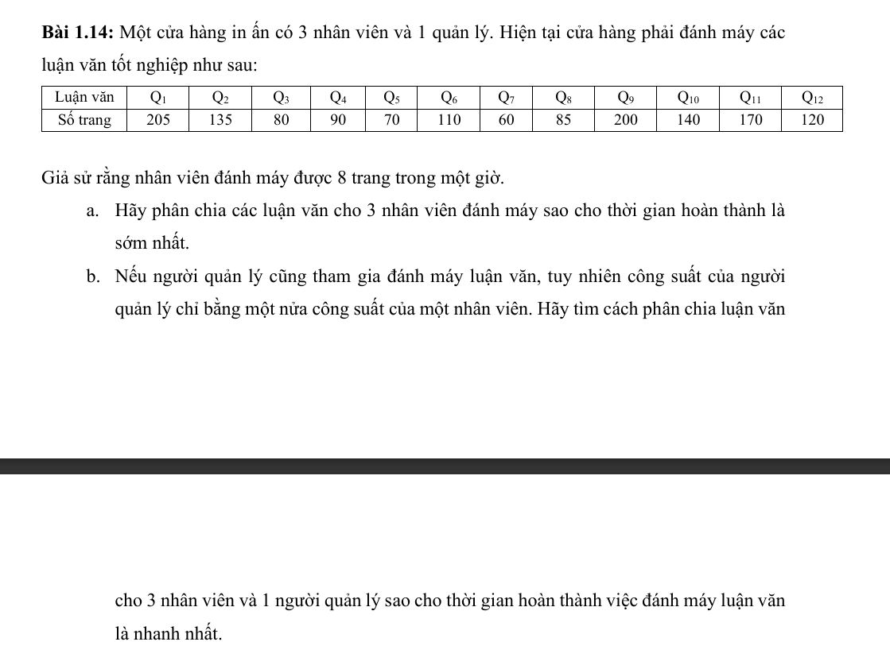
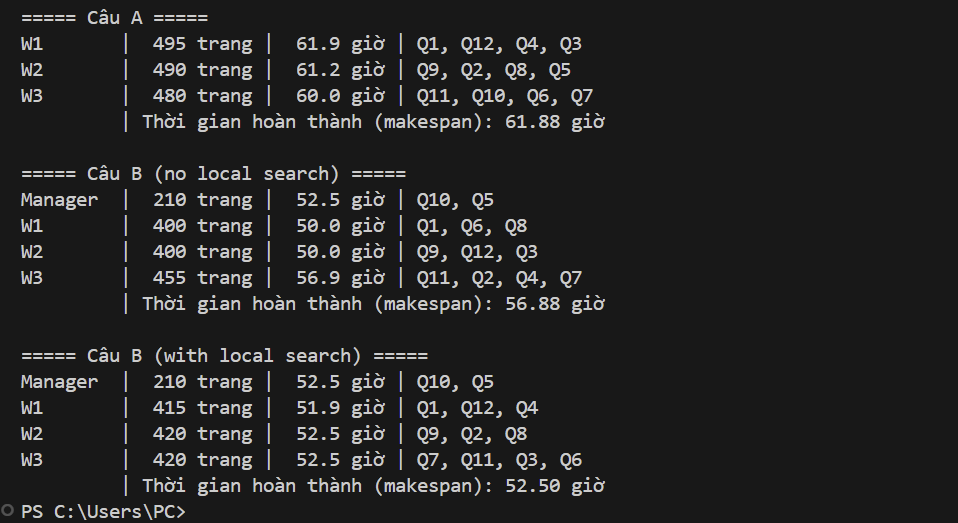

# Bài 1.14 — Phân công luận văn



Cửa hàng có 3 nhân viên, mỗi người đánh máy được 8 trang/giờ, và 1 quản lý có tốc độ 4 trang/giờ. Cần phân 12 luận văn để thời gian hoàn thành của người làm lâu nhất là nhỏ nhất.

## Chạy chương trình

Chương trình chỉ dùng thư viện chuẩn Python:

Chạy từ thư mục `week-2`:

```bash
python "bai 1.14/main.py"
```

## Câu A — 3 nhân viên cùng tốc độ

LPT được dùng trước để tạo cận trên, sau đó chương trình dùng **branch and bound** để duyệt chính xác các phương án phân công:

- Gán luận văn theo thứ tự số trang giảm dần.
- Cắt nhánh nếu tải của một nhân viên đã không thể tốt hơn nghiệm hiện có.
- Không lặp các nhánh chỉ khác nhau ở việc đổi tên những nhân viên đang có cùng tải.

Do đó kết quả Câu A là tối ưu toàn cục:

| Nhân viên | Luận văn | Số trang | Thời gian |
|---|---|---:|---:|
| W1 | Q1, Q9, Q8 | 490 | 61,25 giờ |
| W2 | Q11, Q10, Q12, Q7 | 490 | 61,25 giờ |
| W3 | Q2, Q6, Q4, Q3, Q5 | 485 | 60,63 giờ |

Makespan tối ưu là **490 / 8 = 61,25 giờ**.

## Câu B — 3 nhân viên và 1 quản lý

Vì tốc độ không đồng đều, chương trình cân bằng theo thời gian hoàn thành dự kiến `(pages + pages_mới) / speed`.

1. Khởi tạo tham lam theo thứ tự luận văn giảm dần.
2. Dùng local search với hai lân cận:
   - **MOVE**: chuyển một luận văn sang người khác.
   - **SWAP**: đổi hai luận văn giữa hai người.

Kết quả sau local search có makespan **52,50 giờ**. Quản lý làm 210 trang với tốc độ 4 trang/giờ, nên riêng tải này đã tạo cận dưới 52,50 giờ; vì chương trình đạt cận dưới, kết quả là tối ưu.

## Demo


