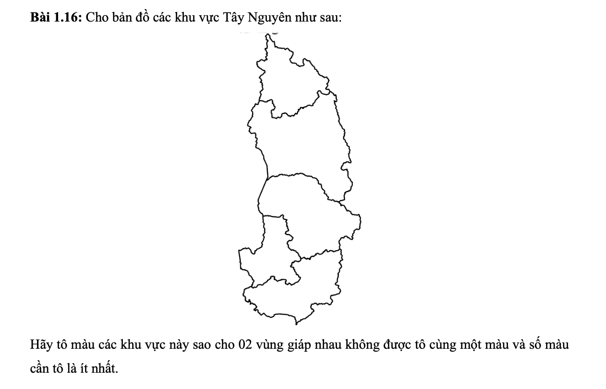

# Bài 1.16 — Tô màu bản đồ Tây Nguyên



## Mục tiêu

Tô màu 5 khu vực Tây Nguyên sao cho hai vùng giáp nhau không cùng màu và số màu sử dụng là ít nhất.

## Yêu cầu

- Python 3.
- Thư viện `matplotlib` để vẽ và xuất ảnh kết quả.

Cài thư viện từ thư mục `week-2` nếu máy chưa có:

```bash
python -m pip install -r "bai 1.16/requirements.txt"
```

## Chạy chương trình

Thực hiện từ thư mục `week-2`:

```bash
python "bai 1.16/main.py"
```

Chương trình sẽ in số màu tối thiểu và màu của từng khu vực, đồng thời tạo ảnh tại:

```text
bai 1.16/ket_qua_to_mau.png
```

## Kết quả mong đợi

```text
So mau it nhat can dung: 3
Ket qua to mau:
- Kon Tum: mau 1
- Gia Lai: mau 2
- Dak Lak: mau 1
- Dak Nong: mau 2
- Lam Dong: mau 3
```

## Thuật toán

Chương trình dùng backtracking: thử số màu từ 1 tăng dần, chỉ gán màu không trùng với vùng kề, và quay lui khi không thể gán tiếp. Vì số màu được thử tăng dần, nghiệm đầu tiên tìm được là tối ưu.
