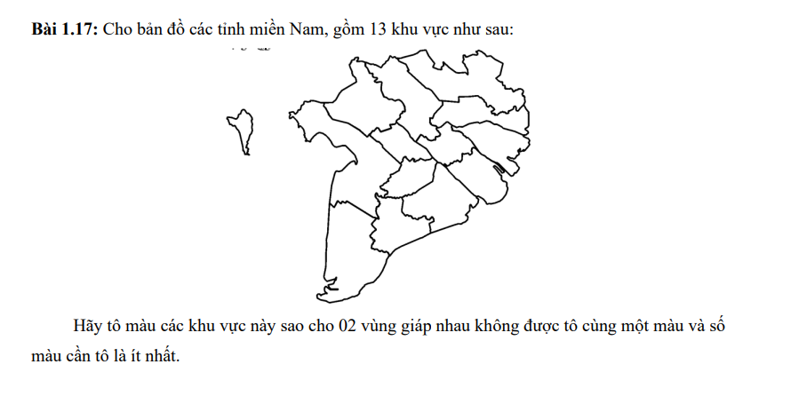

# Bài 1.17 — Tô màu bản đồ 13 tỉnh miền Nam



## Mục tiêu

Tô màu 13 tỉnh sao cho hai tỉnh giáp ranh không cùng màu và số màu dùng là ít nhất.

## Chạy chương trình

Phần giải bài toán chỉ dùng thư viện chuẩn Python:

Chạy từ thư mục `week-2`:

```bash
python "bai 1.17/main.py"
```

Chương trình luôn in phương án tô màu ở terminal. Nếu muốn xuất thêm sơ đồ `ket_qua.png`, cài hai thư viện tùy chọn:

```bash
python -m pip install -r "bai 1.17/requirements.txt"
```

## Thuật toán

Chương trình dùng **DSATUR** để tạo phương án tô màu:

1. Chọn tỉnh chưa tô có độ bão hòa cao nhất — tức giáp với nhiều màu khác nhau nhất.
2. Nếu bằng nhau, ưu tiên tỉnh có nhiều tỉnh kề hơn.
3. Gán màu nhỏ nhất chưa bị dùng bởi các tỉnh kề.

Sau khi tô, `validate_coloring()` kiểm tra tất cả 13 tỉnh đã có màu và mọi cặp tỉnh giáp ranh đều khác màu.

## Chứng minh số màu tối thiểu

Ba tỉnh **Long An**, **Tiền Giang** và **Đồng Tháp** đôi một giáp nhau, tạo thành một tam giác. Vì vậy đồ thị cần ít nhất 3 màu.

Chương trình cũng dùng backtracking thuần Python để kiểm tra khả năng tô bằng `k` màu:

- Không thể tô bằng 2 màu.
- Có thể tô bằng 3 màu.

Do đó sắc số của bản đồ là **3**, và phương án DSATUR được in ra là tối ưu.

## Demo đầu ra

Khi đã cài thư viện vẽ, chương trình lưu sơ đồ tại `ket_qua.png` trong cùng thư mục với `main.py`.
